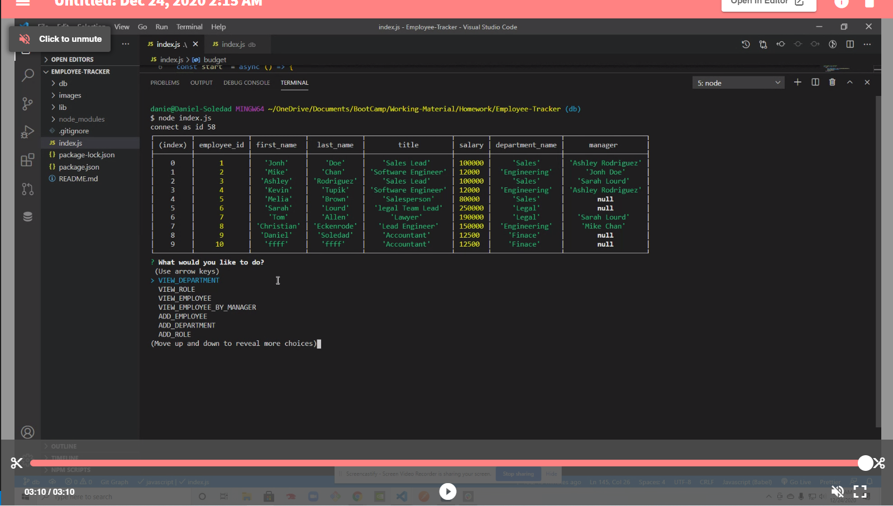

## Employee-Tracker

- [Description](#Description)
- [Installations](#Installations)
- [Licence](#Licence)
- [Contributing](#Contributing)
- [User Story](#User-Story)
- [Acceptance Criteria](#Acceptance-Criteria)
- [Test](#Test)
- [Credits](#Credits)
- [Questions](#Questions)

## Description

This app is a Content Management System, in this app one can create employees, departments and roles. The app used mysql to store all tha the data. The app ask for the necessary data to create all employees, departments, and employees. It can also modify existing data based on the prebuilt actions it has.

## Installations

`nmp i inquire` `npm i mysql`

## Contributing

None at this time

## User-Story

```
As a business owner
I want to be able to view and manage the departments, roles, and employees in my company
So that I can organize and plan my business
```

## Acceptance-Criteria

```
Build a command-line application that at a minimum allows the user to:

  * Add departments, roles, employees

  * View departments, roles, employees

  * Update employee roles

  * Update employee managers

  * View employees by manager

  * Delete departments, roles, and employees

  * View the total utilized budget of a department -- ie the combined salaries of all employees in that department
```

## Licence

[](https://opensource.org/licenses/MIT)

## Test
* Press Image to see video.
[](https://drive.google.com/file/d/1Koldyz8H_Rd-muez00nDhKMjClGKVL1P/view)

## Credits

Trilogy Staff Teachers and TAs

## Questions
Email and follow me on git hub to see my progress
<br>
-Email: [Danielsoledad@gmail.com](mailto:Danielsoledad@gmail.com)
<br>
-GitHub Username: [tuzosdaniel12](https://github.com/tuzosdaniel12) 
